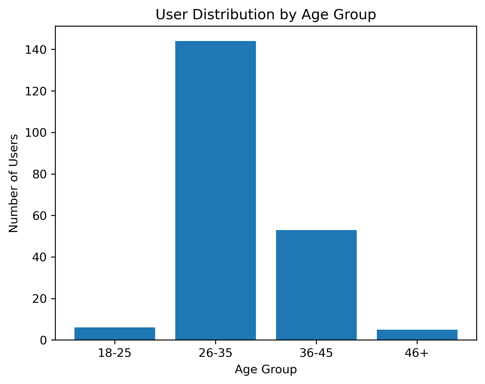
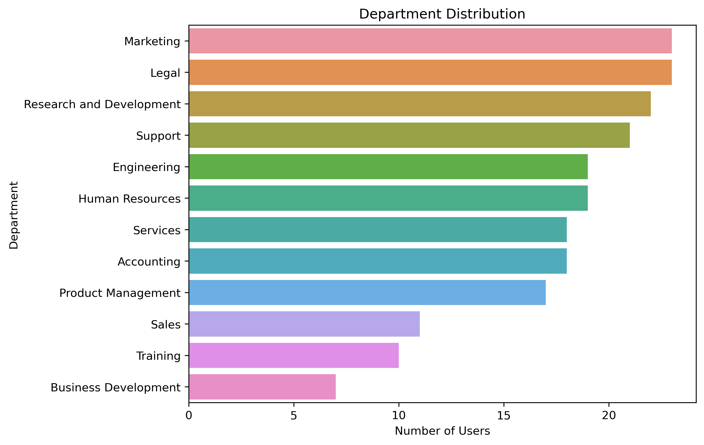
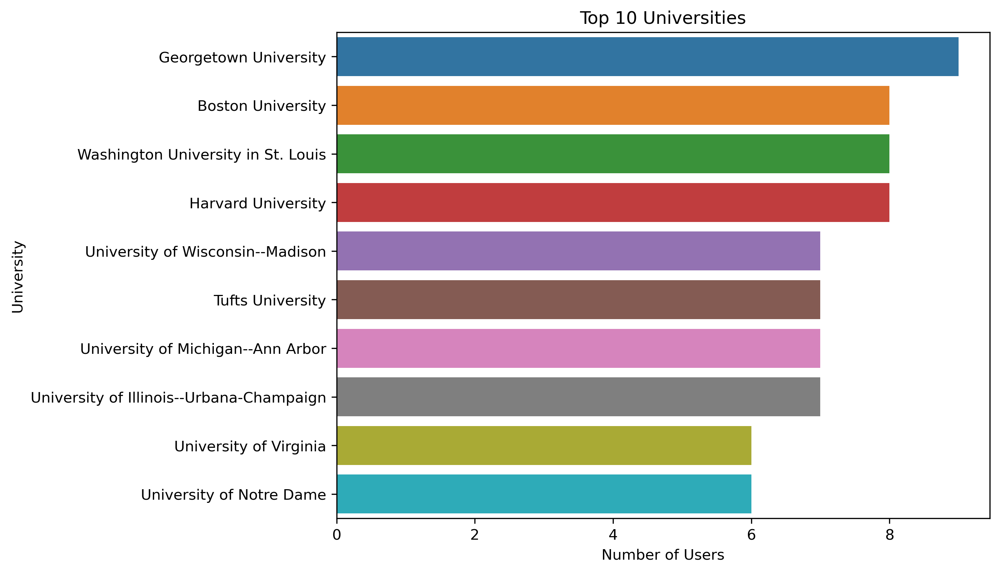
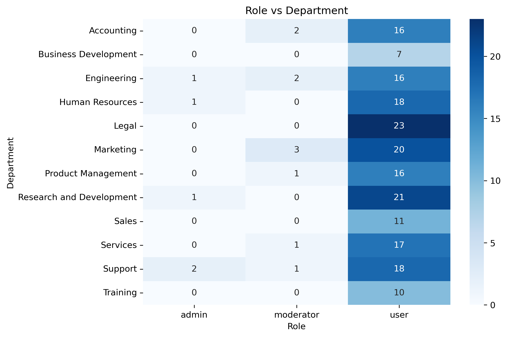
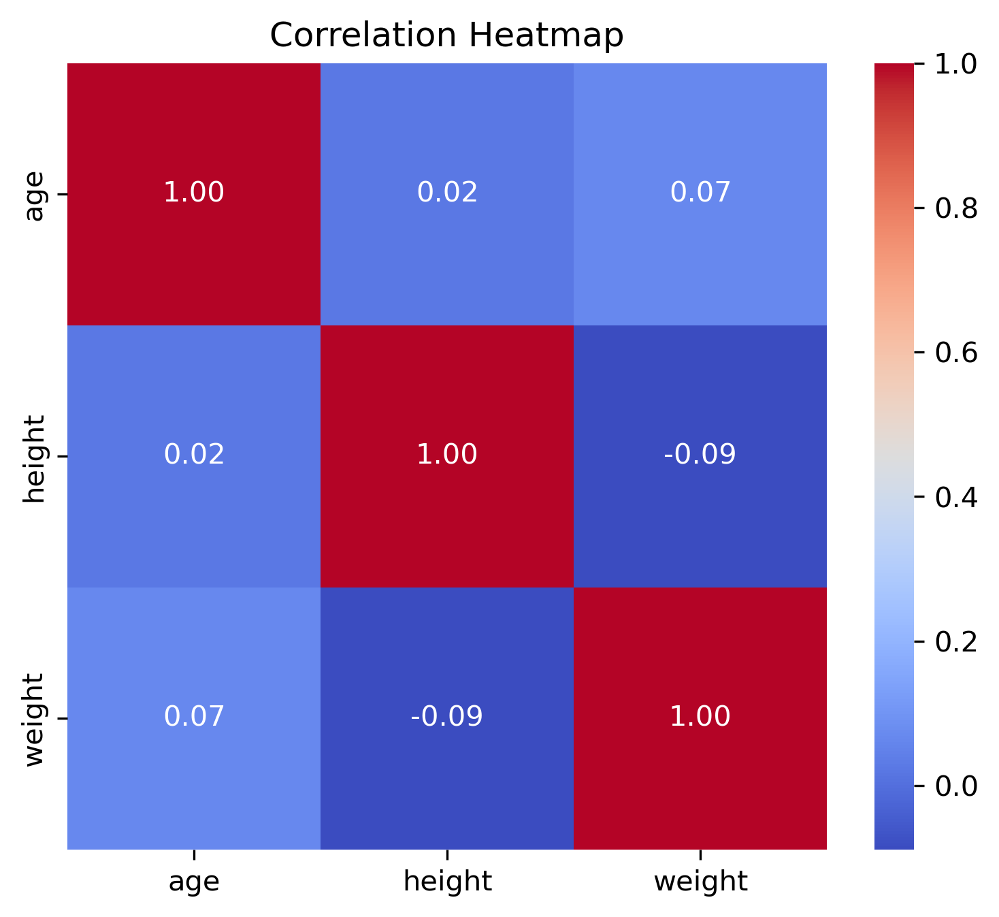

# Final Project – User Data Analysis

## Project Overview

This project focuses on analyzing user data collected from an API source.  
The main objective is to clean, transform, and explore the dataset in order to extract meaningful insights using data analysis and visualization techniques.

The project demonstrates practical skills in data preparation, exploratory data analysis (EDA), and relationship analysis.

---

## Project Structure

Final_Project/

- project.ipynb – Main analysis notebook  
- read.py – Script used to fetch data from the API  
- user.csv – Dataset generated from the API  
- README.md – Project documentation  

---

## Data Source

The dataset was collected using a Python script (`read.py`) that retrieves user data from an API endpoint.  
The script saves the data into a CSV file (`user.csv`) for further analysis.

The dataset includes:

- Demographic information (age, gender, location)
- Professional information (department, role, company)
- Educational background (university)
- Numerical attributes (height, weight)

---

## Data Preparation

The following steps were performed before analysis:

- Converted nested JSON-like columns into structured fields
- Extracted useful features such as:
  - City
  - State
  - Department
  - Role
- Created age groups for demographic segmentation
- Verified missing values and data consistency
- Prepared numerical columns for correlation analysis

---

## Exploratory Data Analysis

The notebook includes the following analyses:

1. Age Distribution  
   - Age group categorization  
   - Identification of the dominant age segment  

2. Gender Distribution  
   - Evaluation of gender balance within the dataset  

3. Department Distribution  
   - Assessment of professional diversity  
   - Identification of the most represented departments  

4. Role Distribution  
   - Analysis of admin, moderator, and user roles  

5. Geographic Distribution  
   - Identification of top states by number of users  

6. Top Universities  
   - Analysis of the most frequently represented universities  
   - Evaluation of academic background diversity  

---

## Visual Results

### Age Group Distribution

### Department Distribution

### Top Universities

### Role vs Department Heatmap

### Correlation Heatmap

---

## Relationship Analysis

The project explores relationships between variables:

- Role vs Department Analysis  
  Cross-tabulation and heatmap visualization were used to determine whether certain departments tend to have more administrative roles.

- Correlation Heatmap  
  Analysis of relationships between numerical variables including:
  - Age  
  - Height  
  - Weight  

The correlation results indicate weak linear relationships among the numerical variables.

---

## Key Insights

- The majority of users fall within the 26–35 age group.
- The dataset reflects diversity across departments without strong dominance by a single field.
- Role distribution appears relatively balanced across departments.
- Academic backgrounds are varied, with no overwhelming concentration in one university.
- Correlation analysis shows no strong linear relationships between age, height, and weight.

## How to Run the Project

1. Install the required libraries:

   pip install -r requirements.txt

2. Run the data fetching script (optional, if regenerating data):

   python read.py

3. Open and execute the notebook:

   project.ipynb

Run all cells sequentially to reproduce the analysis.

---

## Conclusion

This project demonstrates practical application of data cleaning, visualization, and analytical reasoning.  
It highlights the ability to transform structured API data into meaningful insights using Python-based data analysis tools.
